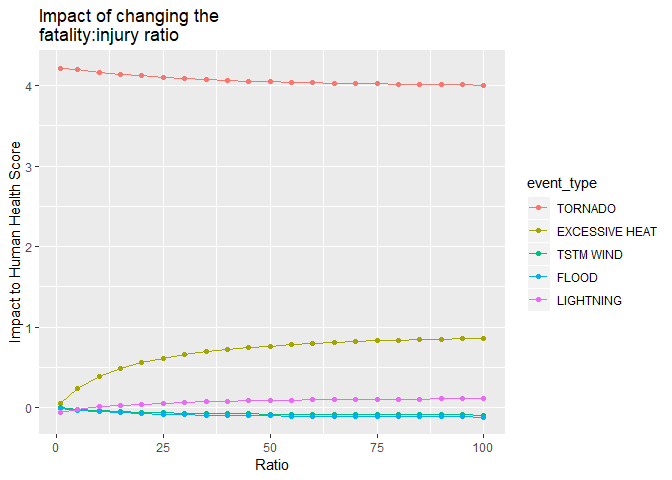
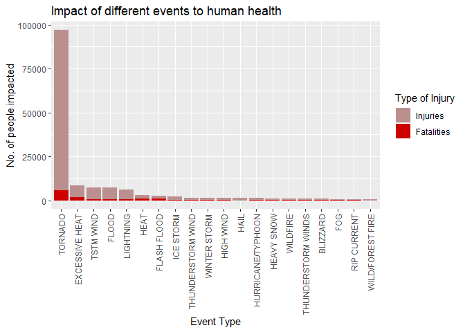
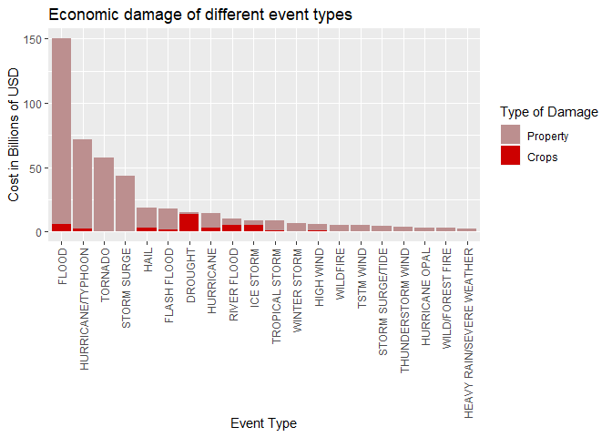

Synopsis
========

Question 1 - Impact on human health
--------------------------------------

* Tornados have the largest impact on human health

* Tornados cause the greatest loss of life

* Tornados cause the most injuries

Question 2 - Largest economic cost
----------------------------------

* Floods cause the most economic damage

* Floods cause the most property damage

* Droughts cause the most crop damage

**NOTE.** Figures are shown in the results section. 
All calculations are shown in the data processing section.


Project Goal
============

Use the data to answer some basic questions about severe weather events.

Questions:
----------

1. Across the United States, which types of events (as indicated in the <span style="color:red" face="KaTeX_Typewriter">EVTYPE</span> variable) are most harmful with respect to population health?

2. Across the United States, which types of events have the greatest economic consequences?


Data Processing
===============

Details about project
---------------------

Copy of the data can be found in the [GitHub directory](https://github.com/benegd/reproducible-research-course-project-2).

Data retrived from the [here](https://d396qusza40orc.cloudfront.net/repdata%2Fdata%2FStormData.csv.bz2)

This project is part of the data science specialization course by John Hopkins University hosted by [Coursera](https://www.coursera.com/).

Consult README.md for more information about the project.


System info
-----------


```r
sessionInfo()
```

```
## R version 3.5.0 (2018-04-23)
## Platform: x86_64-w64-mingw32/x64 (64-bit)
## Running under: Windows 10 x64 (build 17134)
## 
## Matrix products: default
## 
## locale:
## [1] LC_COLLATE=English_Australia.1252  LC_CTYPE=English_Australia.1252   
## [3] LC_MONETARY=English_Australia.1252 LC_NUMERIC=C                      
## [5] LC_TIME=English_Australia.1252    
## 
## attached base packages:
## [1] stats     graphics  grDevices utils     datasets  methods   base     
## 
## loaded via a namespace (and not attached):
##  [1] compiler_3.5.0  backports_1.1.2 magrittr_1.5    rprojroot_1.3-2
##  [5] tools_3.5.0     htmltools_0.3.6 yaml_2.1.19     Rcpp_0.12.17   
##  [9] stringi_1.1.7   rmarkdown_1.10  knitr_1.20      stringr_1.3.1  
## [13] digest_0.6.15   evaluate_0.11
```

Loading Libraries
-----------------

```r
library(plyr)
```

```
## Warning: package 'plyr' was built under R version 3.5.1
```

```r
library(dplyr)
```

```
## Warning: package 'dplyr' was built under R version 3.5.1
```

```
## 
## Attaching package: 'dplyr'
```

```
## The following objects are masked from 'package:plyr':
## 
##     arrange, count, desc, failwith, id, mutate, rename, summarise,
##     summarize
```

```
## The following objects are masked from 'package:stats':
## 
##     filter, lag
```

```
## The following objects are masked from 'package:base':
## 
##     intersect, setdiff, setequal, union
```

```r
library(reshape2)
```

```
## Warning: package 'reshape2' was built under R version 3.5.1
```

```r
library(ggplot2)
```

```
## Warning: package 'ggplot2' was built under R version 3.5.1
```

```r
library(lubridate)
```

```
## Warning: package 'lubridate' was built under R version 3.5.1
```

```
## 
## Attaching package: 'lubridate'
```

```
## The following object is masked from 'package:plyr':
## 
##     here
```

```
## The following object is masked from 'package:base':
## 
##     date
```


Downloading Data from the orginal source
-----------------------------------------


```r
fileurl <- "https://d396qusza40orc.cloudfront.net/repdata%2Fdata%2FStormData.csv.bz2"
zippath <- "./ProjectData/Storm_data.csv.bz2"
projectdatapath <- "./ProjectData"
if(!file.exists(zippath)){
        if(!dir.exists(projectdatapath)){
               dir.create(projectdatapath) 
        }
        download.file(fileurl, zippath)
}
rm(fileurl)
```


Loading the data into R
------------------------

```r
stormdata <- read.csv(zippath)
rm(zippath)
head(stormdata)
```

```
##   STATE__           BGN_DATE BGN_TIME TIME_ZONE COUNTY COUNTYNAME STATE
## 1       1  4/18/1950 0:00:00     0130       CST     97     MOBILE    AL
## 2       1  4/18/1950 0:00:00     0145       CST      3    BALDWIN    AL
## 3       1  2/20/1951 0:00:00     1600       CST     57    FAYETTE    AL
## 4       1   6/8/1951 0:00:00     0900       CST     89    MADISON    AL
## 5       1 11/15/1951 0:00:00     1500       CST     43    CULLMAN    AL
## 6       1 11/15/1951 0:00:00     2000       CST     77 LAUDERDALE    AL
##    EVTYPE BGN_RANGE BGN_AZI BGN_LOCATI END_DATE END_TIME COUNTY_END
## 1 TORNADO         0                                               0
## 2 TORNADO         0                                               0
## 3 TORNADO         0                                               0
## 4 TORNADO         0                                               0
## 5 TORNADO         0                                               0
## 6 TORNADO         0                                               0
##   COUNTYENDN END_RANGE END_AZI END_LOCATI LENGTH WIDTH F MAG FATALITIES
## 1         NA         0                      14.0   100 3   0          0
## 2         NA         0                       2.0   150 2   0          0
## 3         NA         0                       0.1   123 2   0          0
## 4         NA         0                       0.0   100 2   0          0
## 5         NA         0                       0.0   150 2   0          0
## 6         NA         0                       1.5   177 2   0          0
##   INJURIES PROPDMG PROPDMGEXP CROPDMG CROPDMGEXP WFO STATEOFFIC ZONENAMES
## 1       15    25.0          K       0                                    
## 2        0     2.5          K       0                                    
## 3        2    25.0          K       0                                    
## 4        2     2.5          K       0                                    
## 5        2     2.5          K       0                                    
## 6        6     2.5          K       0                                    
##   LATITUDE LONGITUDE LATITUDE_E LONGITUDE_ REMARKS REFNUM
## 1     3040      8812       3051       8806              1
## 2     3042      8755          0          0              2
## 3     3340      8742          0          0              3
## 4     3458      8626          0          0              4
## 5     3412      8642          0          0              5
## 6     3450      8748          0          0              6
```

```r
summary(stormdata)
```

```
##     STATE__                  BGN_DATE             BGN_TIME     
##  Min.   : 1.0   5/25/2011 0:00:00:  1202   12:00:00 AM: 10163  
##  1st Qu.:19.0   4/27/2011 0:00:00:  1193   06:00:00 PM:  7350  
##  Median :30.0   6/9/2011 0:00:00 :  1030   04:00:00 PM:  7261  
##  Mean   :31.2   5/30/2004 0:00:00:  1016   05:00:00 PM:  6891  
##  3rd Qu.:45.0   4/4/2011 0:00:00 :  1009   12:00:00 PM:  6703  
##  Max.   :95.0   4/2/2006 0:00:00 :   981   03:00:00 PM:  6700  
##                 (Other)          :895866   (Other)    :857229  
##    TIME_ZONE          COUNTY           COUNTYNAME         STATE       
##  CST    :547493   Min.   :  0.0   JEFFERSON :  7840   TX     : 83728  
##  EST    :245558   1st Qu.: 31.0   WASHINGTON:  7603   KS     : 53440  
##  MST    : 68390   Median : 75.0   JACKSON   :  6660   OK     : 46802  
##  PST    : 28302   Mean   :100.6   FRANKLIN  :  6256   MO     : 35648  
##  AST    :  6360   3rd Qu.:131.0   LINCOLN   :  5937   IA     : 31069  
##  HST    :  2563   Max.   :873.0   MADISON   :  5632   NE     : 30271  
##  (Other):  3631                   (Other)   :862369   (Other):621339  
##                EVTYPE         BGN_RANGE           BGN_AZI      
##  HAIL             :288661   Min.   :   0.000          :547332  
##  TSTM WIND        :219940   1st Qu.:   0.000   N      : 86752  
##  THUNDERSTORM WIND: 82563   Median :   0.000   W      : 38446  
##  TORNADO          : 60652   Mean   :   1.484   S      : 37558  
##  FLASH FLOOD      : 54277   3rd Qu.:   1.000   E      : 33178  
##  FLOOD            : 25326   Max.   :3749.000   NW     : 24041  
##  (Other)          :170878                      (Other):134990  
##          BGN_LOCATI                  END_DATE             END_TIME     
##               :287743                    :243411              :238978  
##  COUNTYWIDE   : 19680   4/27/2011 0:00:00:  1214   06:00:00 PM:  9802  
##  Countywide   :   993   5/25/2011 0:00:00:  1196   05:00:00 PM:  8314  
##  SPRINGFIELD  :   843   6/9/2011 0:00:00 :  1021   04:00:00 PM:  8104  
##  SOUTH PORTION:   810   4/4/2011 0:00:00 :  1007   12:00:00 PM:  7483  
##  NORTH PORTION:   784   5/30/2004 0:00:00:   998   11:59:00 PM:  7184  
##  (Other)      :591444   (Other)          :653450   (Other)    :622432  
##    COUNTY_END COUNTYENDN       END_RANGE           END_AZI      
##  Min.   :0    Mode:logical   Min.   :  0.0000          :724837  
##  1st Qu.:0    NA's:902297    1st Qu.:  0.0000   N      : 28082  
##  Median :0                   Median :  0.0000   S      : 22510  
##  Mean   :0                   Mean   :  0.9862   W      : 20119  
##  3rd Qu.:0                   3rd Qu.:  0.0000   E      : 20047  
##  Max.   :0                   Max.   :925.0000   NE     : 14606  
##                                                 (Other): 72096  
##            END_LOCATI         LENGTH              WIDTH         
##                 :499225   Min.   :   0.0000   Min.   :   0.000  
##  COUNTYWIDE     : 19731   1st Qu.:   0.0000   1st Qu.:   0.000  
##  SOUTH PORTION  :   833   Median :   0.0000   Median :   0.000  
##  NORTH PORTION  :   780   Mean   :   0.2301   Mean   :   7.503  
##  CENTRAL PORTION:   617   3rd Qu.:   0.0000   3rd Qu.:   0.000  
##  SPRINGFIELD    :   575   Max.   :2315.0000   Max.   :4400.000  
##  (Other)        :380536                                         
##        F               MAG            FATALITIES          INJURIES        
##  Min.   :0.0      Min.   :    0.0   Min.   :  0.0000   Min.   :   0.0000  
##  1st Qu.:0.0      1st Qu.:    0.0   1st Qu.:  0.0000   1st Qu.:   0.0000  
##  Median :1.0      Median :   50.0   Median :  0.0000   Median :   0.0000  
##  Mean   :0.9      Mean   :   46.9   Mean   :  0.0168   Mean   :   0.1557  
##  3rd Qu.:1.0      3rd Qu.:   75.0   3rd Qu.:  0.0000   3rd Qu.:   0.0000  
##  Max.   :5.0      Max.   :22000.0   Max.   :583.0000   Max.   :1700.0000  
##  NA's   :843563                                                           
##     PROPDMG          PROPDMGEXP        CROPDMG          CROPDMGEXP    
##  Min.   :   0.00          :465934   Min.   :  0.000          :618413  
##  1st Qu.:   0.00   K      :424665   1st Qu.:  0.000   K      :281832  
##  Median :   0.00   M      : 11330   Median :  0.000   M      :  1994  
##  Mean   :  12.06   0      :   216   Mean   :  1.527   k      :    21  
##  3rd Qu.:   0.50   B      :    40   3rd Qu.:  0.000   0      :    19  
##  Max.   :5000.00   5      :    28   Max.   :990.000   B      :     9  
##                    (Other):    84                     (Other):     9  
##       WFO                                       STATEOFFIC    
##         :142069                                      :248769  
##  OUN    : 17393   TEXAS, North                       : 12193  
##  JAN    : 13889   ARKANSAS, Central and North Central: 11738  
##  LWX    : 13174   IOWA, Central                      : 11345  
##  PHI    : 12551   KANSAS, Southwest                  : 11212  
##  TSA    : 12483   GEORGIA, North and Central         : 11120  
##  (Other):690738   (Other)                            :595920  
##                                                                                                                                                                                                     ZONENAMES     
##                                                                                                                                                                                                          :594029  
##                                                                                                                                                                                                          :205988  
##  GREATER RENO / CARSON CITY / M - GREATER RENO / CARSON CITY / M                                                                                                                                         :   639  
##  GREATER LAKE TAHOE AREA - GREATER LAKE TAHOE AREA                                                                                                                                                       :   592  
##  JEFFERSON - JEFFERSON                                                                                                                                                                                   :   303  
##  MADISON - MADISON                                                                                                                                                                                       :   302  
##  (Other)                                                                                                                                                                                                 :100444  
##     LATITUDE      LONGITUDE        LATITUDE_E     LONGITUDE_    
##  Min.   :   0   Min.   :-14451   Min.   :   0   Min.   :-14455  
##  1st Qu.:2802   1st Qu.:  7247   1st Qu.:   0   1st Qu.:     0  
##  Median :3540   Median :  8707   Median :   0   Median :     0  
##  Mean   :2875   Mean   :  6940   Mean   :1452   Mean   :  3509  
##  3rd Qu.:4019   3rd Qu.:  9605   3rd Qu.:3549   3rd Qu.:  8735  
##  Max.   :9706   Max.   : 17124   Max.   :9706   Max.   :106220  
##  NA's   :47                      NA's   :40                     
##                                            REMARKS           REFNUM      
##                                                :287433   Min.   :     1  
##                                                : 24013   1st Qu.:225575  
##  Trees down.\n                                 :  1110   Median :451149  
##  Several trees were blown down.\n              :   568   Mean   :451149  
##  Trees were downed.\n                          :   446   3rd Qu.:676723  
##  Large trees and power lines were blown down.\n:   432   Max.   :902297  
##  (Other)                                       :588295
```

```r
str(stormdata)
```

```
## 'data.frame':	902297 obs. of  37 variables:
##  $ STATE__   : num  1 1 1 1 1 1 1 1 1 1 ...
##  $ BGN_DATE  : Factor w/ 16335 levels "1/1/1966 0:00:00",..: 6523 6523 4242 11116 2224 2224 2260 383 3980 3980 ...
##  $ BGN_TIME  : Factor w/ 3608 levels "00:00:00 AM",..: 272 287 2705 1683 2584 3186 242 1683 3186 3186 ...
##  $ TIME_ZONE : Factor w/ 22 levels "ADT","AKS","AST",..: 7 7 7 7 7 7 7 7 7 7 ...
##  $ COUNTY    : num  97 3 57 89 43 77 9 123 125 57 ...
##  $ COUNTYNAME: Factor w/ 29601 levels "","5NM E OF MACKINAC BRIDGE TO PRESQUE ISLE LT MI",..: 13513 1873 4598 10592 4372 10094 1973 23873 24418 4598 ...
##  $ STATE     : Factor w/ 72 levels "AK","AL","AM",..: 2 2 2 2 2 2 2 2 2 2 ...
##  $ EVTYPE    : Factor w/ 985 levels "   HIGH SURF ADVISORY",..: 834 834 834 834 834 834 834 834 834 834 ...
##  $ BGN_RANGE : num  0 0 0 0 0 0 0 0 0 0 ...
##  $ BGN_AZI   : Factor w/ 35 levels "","  N"," NW",..: 1 1 1 1 1 1 1 1 1 1 ...
##  $ BGN_LOCATI: Factor w/ 54429 levels "","- 1 N Albion",..: 1 1 1 1 1 1 1 1 1 1 ...
##  $ END_DATE  : Factor w/ 6663 levels "","1/1/1993 0:00:00",..: 1 1 1 1 1 1 1 1 1 1 ...
##  $ END_TIME  : Factor w/ 3647 levels ""," 0900CST",..: 1 1 1 1 1 1 1 1 1 1 ...
##  $ COUNTY_END: num  0 0 0 0 0 0 0 0 0 0 ...
##  $ COUNTYENDN: logi  NA NA NA NA NA NA ...
##  $ END_RANGE : num  0 0 0 0 0 0 0 0 0 0 ...
##  $ END_AZI   : Factor w/ 24 levels "","E","ENE","ESE",..: 1 1 1 1 1 1 1 1 1 1 ...
##  $ END_LOCATI: Factor w/ 34506 levels "","- .5 NNW",..: 1 1 1 1 1 1 1 1 1 1 ...
##  $ LENGTH    : num  14 2 0.1 0 0 1.5 1.5 0 3.3 2.3 ...
##  $ WIDTH     : num  100 150 123 100 150 177 33 33 100 100 ...
##  $ F         : int  3 2 2 2 2 2 2 1 3 3 ...
##  $ MAG       : num  0 0 0 0 0 0 0 0 0 0 ...
##  $ FATALITIES: num  0 0 0 0 0 0 0 0 1 0 ...
##  $ INJURIES  : num  15 0 2 2 2 6 1 0 14 0 ...
##  $ PROPDMG   : num  25 2.5 25 2.5 2.5 2.5 2.5 2.5 25 25 ...
##  $ PROPDMGEXP: Factor w/ 19 levels "","-","?","+",..: 17 17 17 17 17 17 17 17 17 17 ...
##  $ CROPDMG   : num  0 0 0 0 0 0 0 0 0 0 ...
##  $ CROPDMGEXP: Factor w/ 9 levels "","?","0","2",..: 1 1 1 1 1 1 1 1 1 1 ...
##  $ WFO       : Factor w/ 542 levels ""," CI","$AC",..: 1 1 1 1 1 1 1 1 1 1 ...
##  $ STATEOFFIC: Factor w/ 250 levels "","ALABAMA, Central",..: 1 1 1 1 1 1 1 1 1 1 ...
##  $ ZONENAMES : Factor w/ 25112 levels "","                                                                                                               "| __truncated__,..: 1 1 1 1 1 1 1 1 1 1 ...
##  $ LATITUDE  : num  3040 3042 3340 3458 3412 ...
##  $ LONGITUDE : num  8812 8755 8742 8626 8642 ...
##  $ LATITUDE_E: num  3051 0 0 0 0 ...
##  $ LONGITUDE_: num  8806 0 0 0 0 ...
##  $ REMARKS   : Factor w/ 436781 levels "","-2 at Deer Park\n",..: 1 1 1 1 1 1 1 1 1 1 ...
##  $ REFNUM    : num  1 2 3 4 5 6 7 8 9 10 ...
```

Cleaning the data
-----------------

Converting the BGN_DATE to date format.


```r
stormdata$BGN_DATE <- as.Date(stormdata$BGN_DATE, "%m/%d/%Y")
str(stormdata$BGN_DATE)
```

```
##  Date[1:902297], format: "1950-04-18" "1950-04-18" "1951-02-20" "1951-06-08" "1951-11-15" ...
```

Data on damage cost is provided as a 3 signifcant figure value and a expander letter.

* K = 1 000

* M = 1 000 000

* B = 1 000 000 000

Check if the values provided match the documentation.


```r
unique(stormdata$CROPDMGEXP)
```

```
## [1]   M K m B ? 0 k 2
## Levels:  ? 0 2 B k K m M
```

```r
unique(stormdata$CROPDMGEXP)
```

```
## [1]   M K m B ? 0 k 2
## Levels:  ? 0 2 B k K m M
```

Both these these sets have values which don't match. 
There is no infomation on process these values.
I will use the values as follows.

* Lowercase letters - Indicate the same as the Uppercase letters

* ? - Indicates an NA value

* "+", "-" - Will be ignored

* postive intergers - Will be mutipled by the value using 10^x. Where x is the positive interger.

Converting these values to numeric totals. 


```r
value_from_expander <- function(data, damage_type){
        damage_type_exp <- paste(damage_type, "EXP", sep="")
        damage_value <- as.numeric(data[damage_type])
        damage_exp <- data[damage_type_exp]
        if(damage_exp == "K" || damage_exp == "k"){
                damage_value <- damage_value * 1000
        } else if(damage_exp == "M" || damage_exp == "m"){
                damage_value <- damage_value * 1000000
        } else if(damage_exp == "B" ||damage_exp == "b"){
                damage_value <- damage_value * 1000000000
        } else if(damage_exp == "?"){
                damage_value <- NA
        } else if(is.numeric(damage_exp)){
                damage_value <- damage_value * (10 ^ as.numeric(damage_exp))
        }
        damage_value
}
stormdata$Property_damage_USD <- apply(stormdata, 1, value_from_expander, damage_type = "PROPDMG")
stormdata$Crop_damage_USD <- apply(stormdata, 1, value_from_expander, damage_type = "CROPDMG")
rm(value_from_expander)
stormdata$Total_damage <- with(stormdata, rowSums(cbind(Property_damage_USD, Crop_damage_USD), na.rm = TRUE))
head(stormdata)
```

```
##   STATE__   BGN_DATE BGN_TIME TIME_ZONE COUNTY COUNTYNAME STATE  EVTYPE
## 1       1 1950-04-18     0130       CST     97     MOBILE    AL TORNADO
## 2       1 1950-04-18     0145       CST      3    BALDWIN    AL TORNADO
## 3       1 1951-02-20     1600       CST     57    FAYETTE    AL TORNADO
## 4       1 1951-06-08     0900       CST     89    MADISON    AL TORNADO
## 5       1 1951-11-15     1500       CST     43    CULLMAN    AL TORNADO
## 6       1 1951-11-15     2000       CST     77 LAUDERDALE    AL TORNADO
##   BGN_RANGE BGN_AZI BGN_LOCATI END_DATE END_TIME COUNTY_END COUNTYENDN
## 1         0                                               0         NA
## 2         0                                               0         NA
## 3         0                                               0         NA
## 4         0                                               0         NA
## 5         0                                               0         NA
## 6         0                                               0         NA
##   END_RANGE END_AZI END_LOCATI LENGTH WIDTH F MAG FATALITIES INJURIES
## 1         0                      14.0   100 3   0          0       15
## 2         0                       2.0   150 2   0          0        0
## 3         0                       0.1   123 2   0          0        2
## 4         0                       0.0   100 2   0          0        2
## 5         0                       0.0   150 2   0          0        2
## 6         0                       1.5   177 2   0          0        6
##   PROPDMG PROPDMGEXP CROPDMG CROPDMGEXP WFO STATEOFFIC ZONENAMES LATITUDE
## 1    25.0          K       0                                         3040
## 2     2.5          K       0                                         3042
## 3    25.0          K       0                                         3340
## 4     2.5          K       0                                         3458
## 5     2.5          K       0                                         3412
## 6     2.5          K       0                                         3450
##   LONGITUDE LATITUDE_E LONGITUDE_ REMARKS REFNUM Property_damage_USD
## 1      8812       3051       8806              1               25000
## 2      8755          0          0              2                2500
## 3      8742          0          0              3               25000
## 4      8626          0          0              4                2500
## 5      8642          0          0              5                2500
## 6      8748          0          0              6                2500
##   Crop_damage_USD Total_damage
## 1               0        25000
## 2               0         2500
## 3               0        25000
## 4               0         2500
## 5               0         2500
## 6               0         2500
```


Question 1 - Which types of events are most harmful to human health
-----------------------------------------------------------------------

This question could be interepted in several ways, some things to consider are as follows:

* human health could be considered in the following ways:

        + the most people effected
        
        + only permant effects considered
        
        + only direct fatalities considered
        
        + a different scoring for direct and indirect fatalities/injuries
        
        + a different scoring for fatalities and injuries
        
        
* is there more data available for certain event types and thus could the results be skewed?

* advancements in warning systems may have reduce the damage of particular event types in more recent years, should this be a consideration?

* should the most extreme cases be included or valued the same?

* will the population suffer the same impact from the same event as in previous times

### Assumptions 

* The study doesn't specify if deaths and injury are caused directly or indirectly. For this reason they will be treated of the same value. 

* Since an acurate prediction model for times in between freak event of certain event types isn't available the assumption wil be made the same type and magnitude is as likely to reoccur as any other event type. 

### Have the damage of unusual natural effects changed over time

If there is a correlation between time and the effect in regards to death and injury this should be account for. 

Linear regression will be used, if a p value of less than 0.02 is found then a allowance based on the regression will be used.

This should correlation should include the advancements in any warning systems over time. 

Adding a sum of deaths and injuries to the data. New column will be called FATAL_AND_INJ


```r
stormdata <- stormdata %>% mutate(FATAL_AND_INJ = FATALITIES + INJURIES)
head(stormdata[,c("FATALITIES","INJURIES","FATAL_AND_INJ")])
```

```
##   FATALITIES INJURIES FATAL_AND_INJ
## 1          0       15            15
## 2          0        0             0
## 3          0        2             2
## 4          0        2             2
## 5          0        2             2
## 6          0        6             6
```

Creating a liner regresion model to evaulate the correlation.

Due to the data size and my limited computing power I have had to remove all events that have resulted in no fatalities or injuries for the human health question.


```r
stormdatahealth <- stormdata[stormdata$FATAL_AND_INJ > 0,]
lminjovertime <- lm(FATAL_AND_INJ ~ BGN_DATE, stormdatahealth)
summary(lminjovertime)
```

```
## 
## Call:
## lm(formula = FATAL_AND_INJ ~ BGN_DATE, data = stormdatahealth)
## 
## Residuals:
##     Min      1Q  Median      3Q     Max 
##  -15.00   -5.72   -4.05   -2.40 1731.98 
## 
## Coefficients:
##               Estimate Std. Error t value Pr(>|t|)    
## (Intercept)  1.191e+01  4.501e-01   26.47   <2e-16 ***
## BGN_DATE    -5.596e-04  4.407e-05  -12.70   <2e-16 ***
## ---
## Signif. codes:  0 '***' 0.001 '**' 0.01 '*' 0.05 '.' 0.1 ' ' 1
## 
## Residual standard error: 35.91 on 21927 degrees of freedom
## Multiple R-squared:  0.0073,	Adjusted R-squared:  0.007255 
## F-statistic: 161.2 on 1 and 21927 DF,  p-value: < 2.2e-16
```

Time seems to be coralated to the number of deaths and injurys with a reduction in injuries over time. Thus a pentaly should be given based on the the linear regresion. The total fatalities and injuries will be adjusted using the BGN_DATE coefficient from this model and added to a new variable called FAI_TIME_PEN. 

Another adjust has been made so the pental startes at 0 otherwise the earlier values would be negatives.

The coefficent has been reverse to allow add a pentaly to newer events rather than substracting from the older events

Checking there is a significant difference over time.


```r
timeco <- -as.numeric(lminjovertime$coefficients[2])
rm(lminjovertime)
rmnegdate <- -as.numeric(min(stormdatahealth$BGN_DATE))
#apply seems to extract each variable as character so the as.Date neeeded to be reapplied, this wouldn't be required otherwise
timeallowfunc <- function(x) {
        if(class(x[["BGN_DATE"]]) != "Date"){
             dateasnum <- as.numeric(as.Date(x["BGN_DATE"]))   
        } else {
                dateasnum <- as.numeric(x["BGN_DATE"])
        }
        
        totalhurt <- as.numeric(x["FATAL_AND_INJ"])
        totalhurt + (dateasnum + rmnegdate) * timeco
}
oldestevent <- stormdatahealth[which.min(stormdatahealth$BGN_DATE),]
newestevent <- stormdatahealth[which.max(stormdatahealth$BGN_DATE),]
timeallowfunc(newestevent) - newestevent["FATAL_AND_INJ"]
```

```
##        FATAL_AND_INJ
## 901700       12.6523
```

```r
timeallowfunc(oldestevent) - oldestevent["FATAL_AND_INJ"]
```

```
##       FATAL_AND_INJ
## 28480             0
```

The differnce is substantial enough and thus the allowance will be added. 


```r
stormdatahealth$FAI_TIME_PEN <- apply(stormdatahealth, 1, timeallowfunc)
rm(timeallowfunc, oldestevent, newestevent, rmnegdate, timeco)
head(stormdatahealth[,c("FATAL_AND_INJ", "FAI_TIME_PEN")])
```

```
##   FATAL_AND_INJ FAI_TIME_PEN
## 1            15    15.058754
## 3             2     2.231100
## 4             2     2.291533
## 5             2     2.381063
## 6             6     6.381063
## 7             1     1.381623
```

```r
tail(stormdatahealth[,c("FATAL_AND_INJ", "FAI_TIME_PEN")])
```

```
##        FATAL_AND_INJ FAI_TIME_PEN
## 901862             1     13.65118
## 901933             1     13.64111
## 902003             1     13.64782
## 902128             3     15.64223
## 902129             1     13.64223
## 902183             1     13.64279
```

#### Does the pentaly impact the event type with the largest impact?


```r
penaltyeval <- stormdatahealth %>% group_by(EVTYPE) %>% summarise(TOTAL = sum(FATAL_AND_INJ), TOTAL_W_PEN = sum(FAI_TIME_PEN))
head(arrange(penaltyeval, desc(TOTAL_W_PEN)))
```

```
## # A tibble: 6 x 3
##   EVTYPE         TOTAL TOTAL_W_PEN
##   <fct>          <dbl>       <dbl>
## 1 TORNADO        96979     146905.
## 2 LIGHTNING       6046      40834.
## 3 TSTM WIND       7461      34669.
## 4 EXCESSIVE HEAT  8428      15660.
## 5 FLASH FLOOD     2755      12762.
## 6 FLOOD           7259      11707.
```

```r
head(arrange(penaltyeval, desc(TOTAL)))
```

```
## # A tibble: 6 x 3
##   EVTYPE         TOTAL TOTAL_W_PEN
##   <fct>          <dbl>       <dbl>
## 1 TORNADO        96979     146905.
## 2 EXCESSIVE HEAT  8428      15660.
## 3 TSTM WIND       7461      34669.
## 4 FLOOD           7259      11707.
## 5 LIGHTNING       6046      40834.
## 6 HEAT            3037       5409.
```

The pentaly does have an affect on the order in which the events should be considered to have the largest impact.
However, Tornados clearly have the largest impact in both occasions.

The impact of the zero measure might have impacted the decline. 
Even if the zero measures could be process, there is a possibility they would skew the results as more events are currently recorded than in previous years. 


```r
rm(penaltyeval)
```

### How human health will be considered for this study

Testing to see if changed the ratio of death compared to injury affects the most harmful event type. 

A broad range from 1:1 to 100:1 will be tested. 

Only the 20 event types with the highest health impact will be reviewed.


```r
totalinjsperevent <- stormdatahealth %>% group_by(EVTYPE) %>% summarise(TOTAL_FATAL = sum(FATALITIES), TOTAL_INJ = sum(INJURIES), TOTAL_FAI = sum(FATAL_AND_INJ))
totalinjsperevent <- arrange(totalinjsperevent, desc(TOTAL_FAI))[1:20,]
head(totalinjsperevent)
```

```
## # A tibble: 6 x 4
##   EVTYPE         TOTAL_FATAL TOTAL_INJ TOTAL_FAI
##   <fct>                <dbl>     <dbl>     <dbl>
## 1 TORNADO               5633     91346     96979
## 2 EXCESSIVE HEAT        1903      6525      8428
## 3 TSTM WIND              504      6957      7461
## 4 FLOOD                  470      6789      7259
## 5 LIGHTNING              816      5230      6046
## 6 HEAT                   937      2100      3037
```

Calculating data required for plot.


```r
#creating the x values, which will be the fatality to injury grading ratio
injurygradingratio <- c(1, seq(5,100, by = 5))
#function for calulating the new grade based on the ratio
ratio_calc <- function(event_totals, xvalues){
        total_fatals <- as.numeric(event_totals["TOTAL_FATAL"])
        total_injuries <- as.numeric(event_totals["TOTAL_INJ"])
        total_fatals * xvalues + total_injuries
}
graded_health_scores <- apply(totalinjsperevent, 1, ratio_calc, xvalues = injurygradingratio)
colnames(graded_health_scores) <- totalinjsperevent$EVTYPE
head(graded_health_scores)
```

```
##      TORNADO EXCESSIVE HEAT TSTM WIND FLOOD LIGHTNING  HEAT FLASH FLOOD
## [1,]   96979           8428      7461  7259      6046  3037        2755
## [2,]  119511          16040      9477  9139      9310  6785        6667
## [3,]  147676          25555     11997 11489     13390 11470       11557
## [4,]  175841          35070     14517 13839     17470 16155       16447
## [5,]  204006          44585     17037 16189     21550 20840       21337
## [6,]  232171          54100     19557 18539     25630 25525       26227
##      ICE STORM THUNDERSTORM WIND WINTER STORM HIGH WIND HAIL
## [1,]      2064              1621         1527      1385 1376
## [2,]      2420              2153         2351      2377 1436
## [3,]      2865              2818         3381      3617 1511
## [4,]      3310              3483         4411      4857 1586
## [5,]      3755              4148         5441      6097 1661
## [6,]      4200              4813         6471      7337 1736
##      HURRICANE/TYPHOON HEAVY SNOW WILDFIRE THUNDERSTORM WINDS BLIZZARD
## [1,]              1339       1148      986                972      906
## [2,]              1595       1656     1286               1228     1310
## [3,]              1915       2291     1661               1548     1815
## [4,]              2235       2926     2036               1868     2320
## [5,]              2555       3561     2411               2188     2825
## [6,]              2875       4196     2786               2508     3330
##       FOG RIP CURRENT WILD/FOREST FIRE
## [1,]  796         600              557
## [2,] 1044        2072              605
## [3,] 1354        3912              665
## [4,] 1664        5752              725
## [5,] 1974        7592              785
## [6,] 2284        9432              845
```


Melting the data frame in to x y cordinates and normalizing for ease of viewing.


```r
event_type_count <- ncol(graded_health_scores)
graded_health_scores <- melt(graded_health_scores)
graded_health_scores$Var1 <- rep(injurygradingratio, event_type_count)
colnames(graded_health_scores) <- c("ratio", "event_type", "scores")
norm_graded_health_scores <- graded_health_scores %>% group_by(ratio) %>% mutate_at(vars(scores), funs(scale(.) %>% as.vector()) )
rm(graded_health_scores, event_type_count, injurygradingratio, ratio_calc)
head(norm_graded_health_scores)
```

```
## # A tibble: 6 x 3
## # Groups:   ratio [6]
##   ratio event_type scores
##   <dbl> <fct>       <dbl>
## 1     1 TORNADO      4.22
## 2     5 TORNADO      4.20
## 3    10 TORNADO      4.17
## 4    15 TORNADO      4.14
## 5    20 TORNADO      4.12
## 6    25 TORNADO      4.10
```

Plotting the effect of the ratio.


```r
p <- ggplot(norm_graded_health_scores[1:105,], aes(x=ratio, y=scores, colour = event_type, group = event_type))
p <- p + geom_line()
p <- p + geom_point()
p <- p + labs( x = "Ratio")
p <- p + labs(y = "Impact to Human Health Score")
p <- p + ggtitle("Impact of changing the \nfatality:injury ratio")
p
```

<!-- -->

From this plot we can see that how we ratio is not important in derterming the event type with the largest impact to human health.

Question 2
----------

###Which type of events have the greatest econmic consquence?

###Considerations

Considerations when answering this question:

* should there be an economic value set for the impacts to human health?

* do we need to account for inflation?

* the data set operates in good faith with cost estimates. 
This could cause some discreptances. 
Though a calculation guide is provided. 

* are there null fields in the data


```r
sapply(stormdata, function(x){length(which(is.na(x)))})
```

```
##             STATE__            BGN_DATE            BGN_TIME 
##                   0                   0                   0 
##           TIME_ZONE              COUNTY          COUNTYNAME 
##                   0                   0                   0 
##               STATE              EVTYPE           BGN_RANGE 
##                   0                   0                   0 
##             BGN_AZI          BGN_LOCATI            END_DATE 
##                   0                   0                   0 
##            END_TIME          COUNTY_END          COUNTYENDN 
##                   0                   0              902297 
##           END_RANGE             END_AZI          END_LOCATI 
##                   0                   0                   0 
##              LENGTH               WIDTH                   F 
##                   0                   0              843563 
##                 MAG          FATALITIES            INJURIES 
##                   0                   0                   0 
##             PROPDMG          PROPDMGEXP             CROPDMG 
##                   0                   0                   0 
##          CROPDMGEXP                 WFO          STATEOFFIC 
##                   0                   0                   0 
##           ZONENAMES            LATITUDE           LONGITUDE 
##                   0                  47                   0 
##          LATITUDE_E          LONGITUDE_             REMARKS 
##                  40                   0                   0 
##              REFNUM Property_damage_USD     Crop_damage_USD 
##                   0                   8                   7 
##        Total_damage       FATAL_AND_INJ 
##                   0                   0
```

* could some of the zero could fields be na values?


```r
sum(length(match(0, stormdata$Total_damage)))
```

```
## [1] 1
```

* the damage expanded field has values outside the scope outlined in the documentation.
A method has been developed in the Data Cleaning section.

* other related costs such as debris clearing, fire fighting and personnel overtime charges are not included in these estimates

* flood events require a property damage figure where other events do not, which could skew results

* particular event types might be better documented in regards to damages


### Assumptions 

* Due to the very small number of missing values I have assumed they won't have a large bearing on the results. 

* Due to the very small number of 0 values I have assumed they won't have a large bearing on results.

* Resonable assumptions were made in the damage expansion fields that were outside the documented scope. 
Calculation in the Data Cleaning section.

* Given the lack of predicability of these natural events all will be weighted evenly. 

* The econmic value of a human life required to change the event type that causes the most economic damage will be reviewed.

* it would be possible to go through the event naratives to obtain additional costing in regards to more significant figure estimes. Since there isn't a direct sentence structure stimpulated for data entry extraction would be too difficulat and time consuming for this study. Much of this data is likely missing anyway and small by comparision.

* Inflation will not be accounted for in this analysis as fixed values are supplied for damages in the study and as such the damage estimates should not have increased over time for the same items.


###Creating a damage data summary grouped by event type


```r
#Due to an issue with grouping not working I needed to reattach the plyr and dplyr packages
detach(package:plyr)
detach(package:dplyr)
library(plyr)
```

```
## Warning: package 'plyr' was built under R version 3.5.1
```

```
## 
## Attaching package: 'plyr'
```

```
## The following object is masked from 'package:lubridate':
## 
##     here
```

```r
library(dplyr)
```

```
## Warning: package 'dplyr' was built under R version 3.5.1
```

```
## 
## Attaching package: 'dplyr'
```

```
## The following objects are masked from 'package:plyr':
## 
##     arrange, count, desc, failwith, id, mutate, rename, summarise,
##     summarize
```

```
## The following objects are masked from 'package:lubridate':
## 
##     intersect, setdiff, union
```

```
## The following objects are masked from 'package:stats':
## 
##     filter, lag
```

```
## The following objects are masked from 'package:base':
## 
##     intersect, setdiff, setequal, union
```

```r
Damages_by_event_type <- group_by(stormdata, EVTYPE)
Damages_by_event_type <- summarize(Damages_by_event_type, Property_damage_USD = sum(Property_damage_USD, na.rm = TRUE), Crop_damage_USD = sum(Crop_damage_USD, na.rm = TRUE), Total_damage = sum(Total_damage))
Damages_by_event_type <- arrange(Damages_by_event_type, desc(Total_damage))
head(Damages_by_event_type, 10)
```

```
## # A tibble: 10 x 4
##    EVTYPE            Property_damage_USD Crop_damage_USD  Total_damage
##    <fct>                           <dbl>           <dbl>         <dbl>
##  1 FLOOD                   144657709807       5661968450 150319678257 
##  2 HURRICANE/TYPHOON        69305840000       2607872800  71913712800 
##  3 TORNADO                  56937160779.       414953270  57352114049.
##  4 STORM SURGE              43323536000             5000  43323541000 
##  5 HAIL                     15732267048.      3025954473  18758221521.
##  6 FLASH FLOOD              16140812067.      1421317100  17562129167.
##  7 DROUGHT                   1046106000      13972566000  15018672000 
##  8 HURRICANE                11868319010       2741910000  14610229010 
##  9 RIVER FLOOD               5118945500       5029459000  10148404500 
## 10 ICE STORM                 3944927860       5022113500   8967041360
```

Reducing this data for plotting results.
Only the 20 event types with the largest cost will be shown.


```r
Reduced_damages_by_event_type <- Damages_by_event_type[1:20,] %>% select(-Total_damage) %>% rename(Event_type = EVTYPE)
Reduced_damages_by_event_type$Event_type <- with(Reduced_damages_by_event_type, factor(Event_type, Event_type))
Reduced_damages_by_event_type <- melt(Reduced_damages_by_event_type, id = "Event_type")
colnames(Reduced_damages_by_event_type) <- c("Event_type", "Damage_type", "Cost_USD")
Reduced_damages_by_event_type$Damage_type <- factor(Reduced_damages_by_event_type$Damage_type, labels = c("Property", "Crops"))
head(Reduced_damages_by_event_type)
```

```
##          Event_type Damage_type     Cost_USD
## 1             FLOOD    Property 144657709807
## 2 HURRICANE/TYPHOON    Property  69305840000
## 3           TORNADO    Property  56937160779
## 4       STORM SURGE    Property  43323536000
## 5              HAIL    Property  15732267048
## 6       FLASH FLOOD    Property  16140812067
```


Results
=======

Question 1 - Across the United States are most harmful with respect to population health?
------------------------------------------------------------------------------------------

Potentail impacts did not have a notable effect on the event type that has the largest impact to human health.
The plot will show the number of fatalities and injuries for the 20 highest impact event types. 


```r
totals <- totalinjsperevent %>% arrange(desc(TOTAL_FAI)) %>% select(-TOTAL_FAI)
totals <- melt(totals, id.vars = "EVTYPE", measure.vars = c("TOTAL_FATAL", "TOTAL_INJ"))
colnames(totals) <- c("event", "injury_type","no_of_injuries")
totals$injury_type <- revalue(totals$injury_type, c( "TOTAL_INJ" = "Injuries", "TOTAL_FATAL" = "Fatalities"))
totals$event <- factor(totals$event, levels = totalinjsperevent$EVTYPE)
totals$injury_type <- factor(totals$injury_type, c("Injuries", "Fatalities"))
p <- ggplot(totals, aes(x=event, y=no_of_injuries, fill = injury_type))
p <- p + geom_bar(stat = "identity")
p <- p + scale_fill_manual(values=c("rosybrown", "red3"))
p <- p + guides(fill = guide_legend(reverse = FALSE, title = "Type of Injury"))
p <- p + labs( x = "Event Type")
p <- p + labs(y = "No. of people impacted")
p <- p + ggtitle("Impact of different events to human health")
p <- p + theme(axis.text.x = element_text(angle = 90, hjust = 1, vjust = 0.5))
p
```

<!-- -->


It is clear that Tornados are the event type that has the greatest impact to human health. 
In both injurys and fatalities it is clearly the highest. 

Question 2 - Across the United States, which types of events have the greatest economic consequences?
---------------------------------------------------------------------------------------------------------


```r
p <- ggplot(Reduced_damages_by_event_type, aes(x=Event_type, y=Cost_USD, fill = Damage_type))
p <- p + geom_bar(stat = "identity")
p <- p + scale_fill_manual(values=c("rosybrown", "red3"))
p <- p + guides(fill = guide_legend(reverse = FALSE, title = "Type of Damage"))
p <- p + labs( x = "Event Type")
p <- p + labs(y = "Cost in Billions of USD")
p <- p + scale_y_continuous(labels = c("0","50","100","150"))
p <- p + ggtitle("Economic damage of different event types")
p <- p + theme(axis.text.x = element_text(angle = 90, hjust = 1, vjust = 0.5))
p
```

<!-- -->

It is clear that floods are the event type that cause the most economical damage and property damage.

It is also clear that droughts cause the largest amount of crop damage.

### Reviewing the Economic Value of a life

Looking at the economic value a life would need to have for Tornado to become the highest damage.


```r
Flood_damage_cost <- Damages_by_event_type %>% filter(EVTYPE == "FLOOD") %>% select(Total_damage)
Tornado_damage_cost <- Damages_by_event_type %>% filter(EVTYPE == "TORNADO") %>% select(Total_damage)
Flood_fatalities <- totalinjsperevent %>% filter(EVTYPE == "FLOOD") %>% select(TOTAL_FATAL)
Tornado_fatalities <- totalinjsperevent %>% filter(EVTYPE == "TORNADO") %>% select(TOTAL_FATAL)
cost_per_life <- (Tornado_damage_cost - Flood_damage_cost)/(Flood_fatalities - Tornado_fatalities)
cost_per_life
```

```
##   Total_damage
## 1     18006501
```

I human life would need to have an economic value of over 18 Million before tornados caused the highest economical damage.


